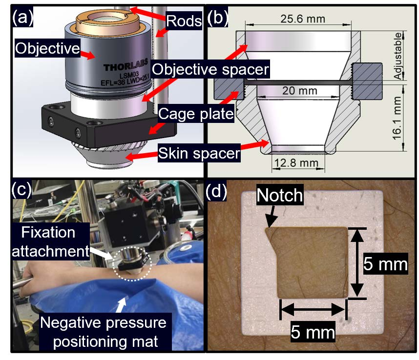

Hardware desings and software sorce code related to Yu Guo et al. (2025).
=========================================================================

This repository provides the hardware desing files (SolidWorks CAD files) and software soruce codes for motion correction of optical coherence (OCT) tomography for in vivo dynamic OCT imaging.
The details of the in vivo dynamic and the use of the presented hardware and software are described in details in Yu Guo et al, arXiv (2025).

Folders and files 
-------------------
### Hardware folder
The "Hardware" folder consists of 3D CAD files of sample fixation attachment for in vivo dynamic OCT. 
The main assemble file is Assem_setup.SLDASM, and it is made by SolidWorks (Ver. 2020 SP5.0).
In order to correctly opne this file, **you need to down load the following three additional CAD files** from Thorlabs' web site as follows.

- CP33-Solidworks.sldprt : can be found at this [Thorlabs product page](https://www.thorlabs.com/thorproduct.cfm?partnumber=CP33/M), SolidWorks CAD file. Here is [the direct link to the CAD file](https://www.thorlabs.com/_sd.cfm?fileName=TTN189114-E0W.sldprt&partNumber=CP33/M).
- ER4E-Solidworks.sldprt : can be found at this [Thorlabs product page](https://www.thorlabs.com/thorproduct.cfm?partnumber=ER4E), SolidWorks CAD file. Here is [the direct link to the CAD file](https://www.thorlabs.com/_sd.cfm?fileName=23114-E0W.sldprt&partNumber=ER4E).
- LSM03-Solidworks.sldprt : can be found at this [Thorlabs product page](https://www.thorlabs.co.jp/thorproduct.cfm?partnumber=LSM03), SolidWorks CAD file. Here is [the direct link to the CAD file](https://www.thorlabs.co.jp/_sd.cfm?fileName=16597-E0W.sldprt&partNumber=LSM03).

### Software folder
The "Software" folder consists of Python program for inter-OCT-frame motion correction.
This program requires the following libraries.
- [OpenCV for Python](https://pypi.org/project/opencv-python/) (CV2).
- [NumPy](https://numpy.org/)
- [SciPy](https://scipy.org/)
- [scikit-image](https://scikit-image.org/)
- [tifffile](https://pypi.org/project/tifffile/)

Related papers
-----------------------
The details of the design and the use of the hardware and software provided by this repository are described in the following research paper.
1. Y. Guo, R. Morishita, I.A. El-Sadek, K. Yamazaki, S. Sakai, P. Mukherjee, Y. Lim, C. Bao, K. Sugata, S. Kasamatsu, H. Yoshida, S. Makita, and Y. Yasuno, "In vivo dynamic optical coherence tomography of human skin with hardware- and software-based motion correction," arXiv (2025).

Authors and License
-----------------------
The files provided by this repository are authored by [Computational Optics Group at the University of Tsukuba](https://cog-news.blogspot.com/).

This library is licensed under MIT license.
The users can freely use the design and software provided by this repository, but it is recommended to cite this web-site and the proper reference papers listed in "Related papers" section.

For any questions, please contact the following representative.
- Yoshiaki Yasuno, University of Tsukuba, yoshiaki.yasuno@cog-labs.org
